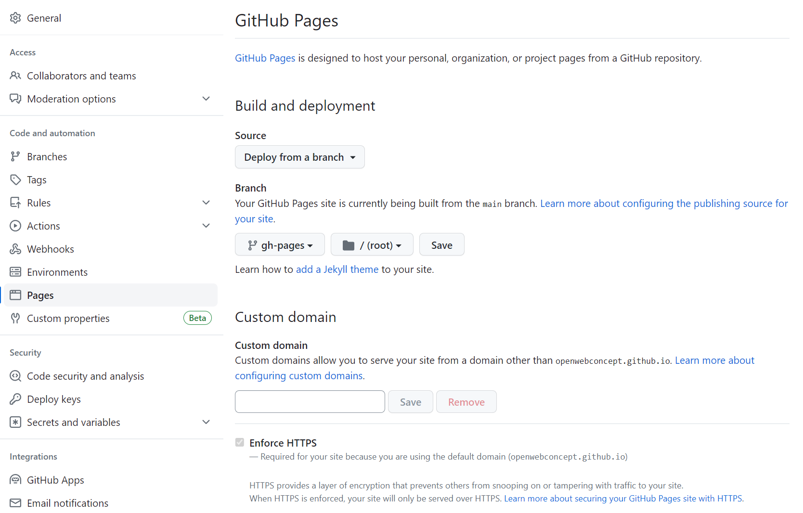
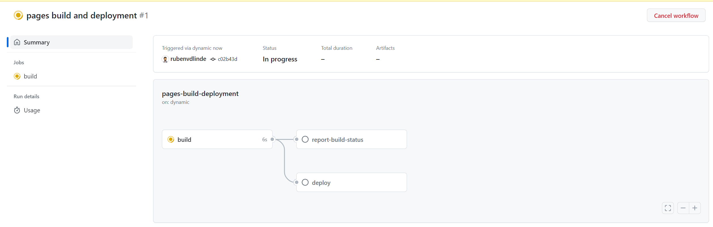
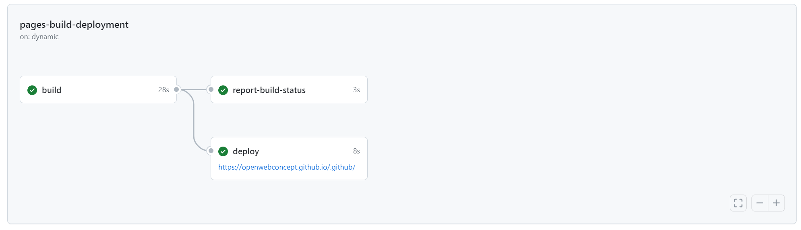

# Productpage action
This action builds on repository specific product page as static github page.

## Usage
To use this action, simply include it as a step in your workflow file. No inputs are required.

````yaml
name: My Product Page Workflow

on:
  schedule:
    - cron: '0 0 * * *'

jobs:
  build:
    runs-on: ubuntu-latest
    steps:
      - name: Deploy Product Github Page
        uses: OpenCatalogi/productpage-action@main
````

In the above example an page is created or updated every night at 0:00, we advise this route becouse you will autmaticly suplied with fixes and new features. You can however also choose other options to trigger a page build

To trigger a page build whenever you commit something to the main  branche
````yaml
on:
  push:
    branches:
      - main
````

To gain a bit more control and only trigger a page build manually usw
````yaml
on:
  
  workflow_dispatch:
````
> **Warning**
> If you do not supply the action with an access token or an SSH key, you must access your repositories settings and provide `Read and Write Permissions` to the provided `GITHUB_TOKEN`, otherwise you'll potentially run into permission issues. Alternatively you can set the following in your workflow file to grant the action the permissions it needs.

```yml
permissions:
  contents: write
```

> **Note**
> When you first run the workflow you need to `manually` activate github pages on your repository! Head over to setting -> pages. Select `deploy form a branch` as a source and `gh-pages` as your branche (unles you configured the page to be build in a differend branche)
> 
> Afther pressing save head over tot the actions and take a look at the `pages build and deployment` action
> 
> When it is done it will also tell you under wich link you can find your page
> 

## Input
| Input Name                          | Description                                                                   | Default Value                                                            |
|------------------------------------|-------------------------------------------------------------------------------|--------------------------------------------------------------------------|
| `github_pages_branch`               | The branch on which the GitHub page will be built (Optional)                | `gh-pages`                                                               |
| `github_repository_name_as_prefix`  | Whether to use the GitHub repository name as a prefix (Optional)             | `true`                                                                   |
| `repository`                        | The GitHub repository to use (could be an external repository) (Optional)   | `github.event.repository.url`                                            |
| `github_api_base_url`               | The base URL to get the README.md from (Optional)                            | `https://api.github.com/repos/OpenCatalogi/.github/contents/`             |
| `favicon_url`                      | A base64 encoded SVG file or URL to the image used as favicon (Optional)     | `https://www.rotterdam.nl/favicon.ico?v=2`                               |
| `navbar_logo`                      | A base64 encoded SVG file or URL to the logo used in the main menu (Optional)| `https://openwebconcept.nl/wp-content/themes/openwebconcept/assets/src/images/logo@2x.png` |
| `github_docs_directory_paths`       | The menu item shown and the locations that they are collected from (Optional)| `[{"name": "Handleidingen", "location": "/docs/handleidingen"},{"name": "Roadmap", "location": "/docs/roadmap"}]` |
| `read_the_docs_url`                | The documentation URL (set to empty to omit documentation from your menu) (Optional) | `https://commongateway.readthedocs.io/en/latest/`                |
| `slack_url`                        | The Slack URL (set to empty to omit Slack from your menu) (Optional)          | `https://join.slack.com/t/samenorganiseren/shared_invite/zt-22wtrcb1y-RMdSp6C1LMhUaCZQlL9trQ` |
| `jumbotron_title`                  | The title of the jumbotron (Optional)                                       | `github.event.repository.name`                                          |
| `jumbotron_subtitle`               | The (short) subtitle used in the jumbotron (Optional)                       | `Product page`                                                           |
| `jumbotron_description`            | The (long) description included in the jumbotron (Optional)                 | `github.event.repository.description`                                     |
| `jumbotron_logo`                   | A base64 encoded SVG file or URL to the logo used in the jumbotron (Optional) | ''                                                                     |
| `footer_logo`                      | The logo in the footer (Optional)                                           | `https://openwebconcept.nl/wp-content/themes/openwebconcept/assets/src/images/logo@2x.png` |
| `footer_logo_url`                  | The URL that the footer image will link to (set to blank to not link) (Optional) | `https://openwebconcept.nl/` |
| `nl_design_theme_classname`        | The class name of the desired NL design theme (Optional)                    | `open-webconcept-theme`                                                  |
| `gitname`                          | Git name configuration for bump commit (Optional)                            | `Open Catalogi bot`                                                     |
| `gitmail`                          | Git mail configuration for bump commit (Optional)                            | `bot@opencatalogi.nl`                                                   |

## Output
| Output Name     | Description                                                              |
|-----------------|--------------------------------------------------------------------------|
| `version`       | New version of the `softwareVersion` field in `publiccode.yml`          |
| `releaseDate`   | New release date of the `releaseDate` field in `publiccode.yml`        |

## Tips
Besides making your product readable for humans its als a good idea to make it machisne readable, this helps your project to be indexed by the likes of opencatalogi.nl. Luckily this is very simple, just ad the publiccode action to your workflow

````yaml
name: My PublicCode Workflow

on:
  push:
    branches:
      - main

jobs:
  build:
    runs-on: ubuntu-latest
    steps:
      - name: Deploy Product Github Page
        uses: OpenCatalogi/productpage-action@main
      - name: Update publiccode.yaml
        uses: OpenCatalogi/publiccode-action@main
````

[Read more](https://github.com/marketplace/actions/create-or-update-publiccode-yaml) about the publiccode action

## Special thanxs
As is the case with most software this action is based on the work of others, and uses there code. We would like to give a special shout out to the following parties and thier code

- [James Ives | github-pages-deploy-action#readme](https://github.com/JamesIves/github-pages-deploy-action#readme]).
- [SpicyPizza | create-envfile](https://github.com/SpicyPizza/create-envfile).

## Maintainers
This software is maintained by [Conduction b.v.](https://conduction.nl/)

## License
© 2023 Conduction B.V.

Licensed under the EUPL. The version control system provides attribution for specific lines of code.

## Remarks
This GitHub Action is published in the GitHub Marketplace. As such, you can find the [Terms of Service here](). Also, [here]() you can find the GitHub Marketplace Developer Agreement.

